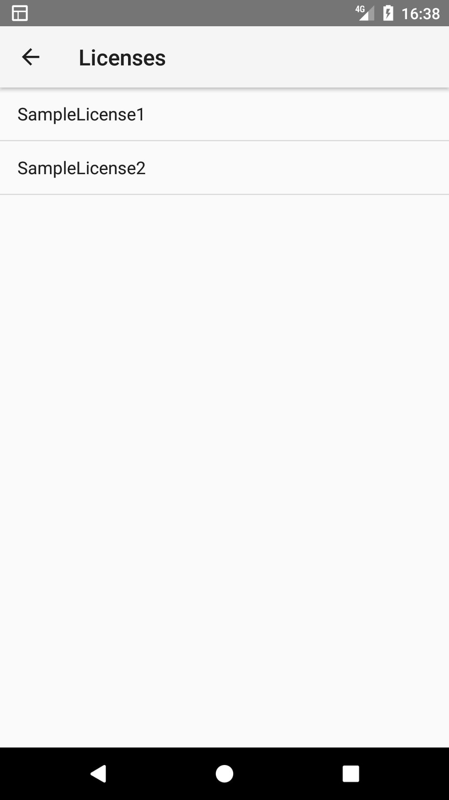
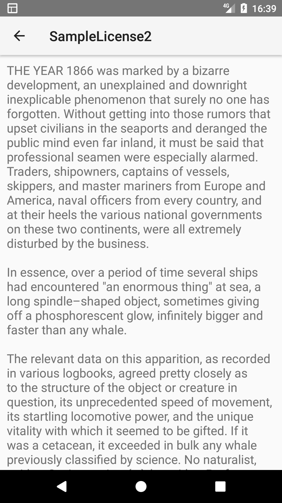

# License Viewer
License Viewer is a library to show legal information of your Android app.

 

## Usage
0. Add dependency:
```gradle
repositories {
    google()
    mavenCentral()
    maven { url 'https://jitpack.io' } // <-- Add this
}
```
```gradle
compile 'com.github.kofuk:LicenseViewer:1.6.5'
```

1. Put your license text files in your `assets/license` folder. (File name must be `LICENSE_NAME.txt` format)

2. Open licenses from your java code.
```
import com.chronoscoper.library.licenseviewer.LicenseViewer;

public class MyActivity extends Activity {
    @Override
    protected void onCreate(Bundle savedInstanceState) {
        super.onCreate(savedInstanceState);

        //Opens the list of licenses
        LicenseViewer.open(this, "Licenses");
    }
}
```
Title will be displayed as an Activity title in the ActionBar.

## License
```
Copyright 2017-2024 Koki Fukuda

Licensed under the Apache License, Version 2.0 (the "License");
you may not use this file except in compliance with the License.
You may obtain a copy of the License at

    http://www.apache.org/licenses/LICENSE-2.0

Unless required by applicable law or agreed to in writing, software
distributed under the License is distributed on an "AS IS" BASIS,
WITHOUT WARRANTIES OR CONDITIONS OF ANY KIND, either express or implied.
See the License for the specific language governing permissions and
limitations under the License.
```
